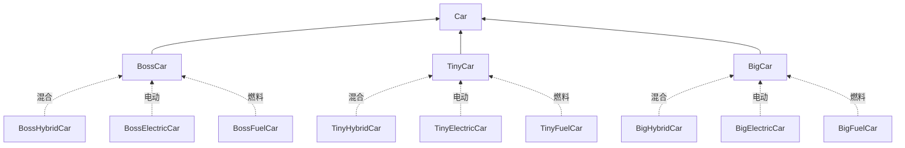
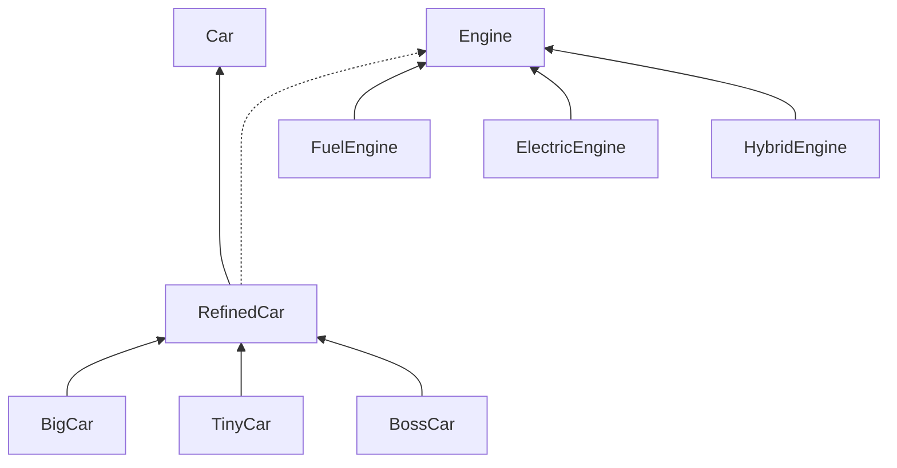

[TOC]
# 概念

设计模式，即Design Patterns，是指在软件设计中，被反复使用的一种代码设计经验。

# 为什么要使用设计模式？

使用设计模式的目的是为了可重用代码，提高代码的可扩展性和可维护性。

# 开闭原则

软件应该对扩展开放，而对修改关闭；

这里的意思是在增加新功能的时候，能不改代码就尽量不需要改，如果新增代码就能完成，那是最好的。

# 里式替换原则

就是说我们调用父类的一个方法可以成功，那么替换成子类调用也应该完全可以运行

# 创建型设计模式

创建型模型关注点是如何创建对象，其核心思想是要把对象的创建和使用相分离，这样使两者能够相对独立的变换。

创建型模式包括：

- 工厂方法：Factory Method
- 抽象工厂：Abstract Method
- 创造者：Builder
- 原型：Prototype
- 单例：Singleton

## 工厂方法模式（静态工厂）

### 概念

> 定义一个创建对象的接口，让子类决定实例化哪个类。Factory Method使一个类的实例化延迟到其子类。
>
> 下面以静态工厂为例：


````mermaid
graph BT
productImpl[ProductImpl]-->product[Product]
factoryImpl[FactoryImpl]--->factory[Factory]
factoryImpl.->productImpl

````

### 工厂接口

```java
package com.maben.remote_debug.design_patterns.factory_method;

/**
 * 解析字符串到Number
 */
public interface NumberFactory {
    /**
     * 字符串转Number
     * @param s s
     * @return number
     */
    Number parse(String s);

    static NumberFactory impl = new NumberFactoryImpl();
    /**
     * 获取实现类实例
     * @return 实现类
     */
    static NumberFactory getFactory() {
        return impl;
    }
}
```

### 工厂实现类

````java
package com.maben.remote_debug.design_patterns.factory_method;

import java.math.BigDecimal;

public class NumberFactoryImpl implements NumberFactory {
    @Override
    public Number parse(String s) {
        return new BigDecimal(s);
    }
}
````

### 测试类

```java
package com.maben.remote_debug.design_patterns.factory_method;

public class MT001 {
    public static void main(String[] args) {
        final NumberFactory factory = NumberFactory.getFactory();
        System.out.println(factory.parse("1245"));
    }
}
```

### 总结

调用方可以完全忽略真正的工厂`NumberFactoryImpl`和实际的产品`BigDecimal`，这样做的好处是允许创建产品的代码独立地变换，而不会影响到调用方。

比方说：发消息场景。工厂类中有发消息接口，但是工厂实现类中需要传递发什么消息的参数，有短信、有APP信息等等，但是里面具体是哪个调用端不关心。

这种简化的使用静态方法创建产品的方式称为 <font color="red">静态工厂方法（Static Factory Method）</font>。静态工厂方法广泛地应用在Java标准库中。

例如：(MD5)

```java
MessageDigest md5 = MessageDigest.getInstance("MD5");
MessageDigest sha1 = MessageDigest.getInstance("SHA-1");
```

## 抽象工厂模式

### 概念

提供一个创建一系列相关或相关依赖对象的接口，而无需指定他们具体的类。

这种模式有点类似于多个供应商负责提供一系列类型的产品。

````mermaid
graph LR
client....->factory
factory...->productA
factory...->productB

factory1------>factory
factory1.->productA1
factory1.->productB1

factory2------>factory
factory2.->productA2
factory2.->productB2
````

### 工厂接口

````java
package com.maben.remote_debug.design_patterns.abstract_factory.service;

public interface AbstractFactory {
    // 创建Html文档:
    HtmlDocument createHtml(String md);
    // 创建Word文档:
    WordDocument createWord(String md);
}
````

### 工厂接口实现类

#### FastFactory

````java
package com.maben.remote_debug.design_patterns.abstract_factory.fast_factory;


import com.maben.remote_debug.design_patterns.abstract_factory.service.AbstractFactory;
import com.maben.remote_debug.design_patterns.abstract_factory.service.HtmlDocument;
import com.maben.remote_debug.design_patterns.abstract_factory.service.WordDocument;

public class FastFactory implements AbstractFactory {

	@Override
	public HtmlDocument createHtml(String md) {
		return new FastHtmlDocument(md);
	}

	@Override
	public WordDocument createWord(String md) {
		return new FastWordDocument(md);
	}
}
````

#### GoodFactory

````java
package com.maben.remote_debug.design_patterns.abstract_factory.good_factory;

import com.maben.remote_debug.design_patterns.abstract_factory.service.AbstractFactory;
import com.maben.remote_debug.design_patterns.abstract_factory.service.HtmlDocument;
import com.maben.remote_debug.design_patterns.abstract_factory.service.WordDocument;

public class GoodFactory implements AbstractFactory {

	@Override
	public HtmlDocument createHtml(String md) {
		return new GoodHtmlDocument(md);
	}

	@Override
	public WordDocument createWord(String md) {
		return new GoodWordDocument(md);
	}
}

````

### 产品接口

#### HtmlDocument

````java
package com.maben.remote_debug.design_patterns.abstract_factory.service;

import java.io.IOException;
import java.nio.file.Path;

public interface HtmlDocument {
    String toHtml();
    void save(Path path) throws IOException;
}
````

#### WordDocument

````java
package com.maben.remote_debug.design_patterns.abstract_factory.service;

import java.io.IOException;
import java.nio.file.Path;

public interface WordDocument {
    void save(Path path) throws IOException;
}
````

### 产品接口实现类

#### FastHtmlDocument

````java
package com.maben.remote_debug.design_patterns.abstract_factory.fast_factory;

import com.maben.remote_debug.design_patterns.abstract_factory.service.HtmlDocument;

import java.io.IOException;
import java.nio.file.Files;
import java.nio.file.Path;


public class FastHtmlDocument implements HtmlDocument {

	private String md;

	public FastHtmlDocument(String md) {
		this.md = md;
	}

	@Override
	public String toHtml() {
		return "FastHtmlDocument -- save --- "+md;
	}

	@Override
	public void save(Path path) throws IOException {
		Files.write(path, toHtml().getBytes("UTF-8"));
	}
}
````

#### GoodHtmlDocument

````java
package com.maben.remote_debug.design_patterns.abstract_factory.good_factory;

import com.maben.remote_debug.design_patterns.abstract_factory.service.HtmlDocument;

import java.io.IOException;
import java.nio.file.Files;
import java.nio.file.Path;

public class GoodHtmlDocument implements HtmlDocument {

	private String md;

	public GoodHtmlDocument(String md) {
		this.md = md;
	}

	@Override
	public String toHtml() {
		return "GoodHtmlDocument --- save --- "+md;
	}

	@Override
	public void save(Path path) throws IOException {
		Files.write(path, toHtml().getBytes("UTF-8"));
	}
}
````

#### FastWordDocument

````java
package com.maben.remote_debug.design_patterns.abstract_factory.fast_factory;

import com.maben.remote_debug.design_patterns.abstract_factory.service.WordDocument;

import java.io.IOException;
import java.nio.file.Files;
import java.nio.file.Path;


public class FastWordDocument implements WordDocument {

	private String md;

	public FastWordDocument(String md) {
		this.md = md;
	}

	@Override
	public void save(Path path) throws IOException {
		String content = "FastWordDocument -- save --- "+md;
		Files.write(path, content.getBytes("UTF-8"));
	}
}
````

#### GoodWordDocument

````java
package com.maben.remote_debug.design_patterns.abstract_factory.good_factory;

import com.maben.remote_debug.design_patterns.abstract_factory.service.WordDocument;

import java.io.IOException;
import java.nio.file.Files;
import java.nio.file.Path;

public class GoodWordDocument implements WordDocument {

	private String md;

	public GoodWordDocument(String md) {
		this.md = md;
	}

	@Override
	public void save(Path path) throws IOException {
		String content = "GoodWordDocument --> save --- "+md;
		Files.write(path, content.getBytes("UTF-8"));
	}
}
````

### 测试类

````java
package com.maben.remote_debug.design_patterns.abstract_factory;

import com.maben.remote_debug.design_patterns.abstract_factory.fast_factory.FastFactory;
import com.maben.remote_debug.design_patterns.abstract_factory.good_factory.GoodFactory;
import com.maben.remote_debug.design_patterns.abstract_factory.service.AbstractFactory;
import com.maben.remote_debug.design_patterns.abstract_factory.service.HtmlDocument;
import com.maben.remote_debug.design_patterns.abstract_factory.service.WordDocument;

import java.io.IOException;
import java.nio.file.Paths;

public class MT001 {
    public static void main(String[] args) throws IOException {
        AbstractFactory fastFactory = new FastFactory();
        HtmlDocument fastHtml = fastFactory.createHtml("#Hello\nHello, world!");
        System.out.println(fastHtml.toHtml());
        fastHtml.save(Paths.get(".", "fast.html"));
        WordDocument fastWord = fastFactory.createWord("#Hello\nHello, world!");
        fastWord.save(Paths.get(".", "fast.doc"));

        AbstractFactory goodFactory = new GoodFactory();
        HtmlDocument goodHtml = goodFactory.createHtml("#Hello\nHello, world!");
        System.out.println(goodHtml.toHtml());
        goodHtml.save(Paths.get(".", "good.html"));
        WordDocument goodWord = goodFactory.createWord("#Hello\nHello, world!");
        goodWord.save(Paths.get(".", "good.doc"));
    }
}
````

## 生成器模式（建造者模式）

### 概念

> 生成器模式也称之为建造者模式。生成器模式意图在于将一个复杂对象的构建与它的表示分离，使得同样的构建过程可以创建不同的表示；
>
> 生成器模式（Builder）是使用多个“小型”工厂来最终创建出一个完整对象。
>
> 当我们使用Builder的时候，一般来说，是因为创建这个对象的步骤比较多，每个步骤都需要一个零部件，最终组合成一个完整的对象。

````mermaid
classDiagram

URLBuilder <|-- String


class URLBuilder{
	String	scheme
	int port
	String domain
	String path
	String username
	String password
	Map<String,String> query
	
	build() String
	setScheme() URLBuilder
	setDomain() URLBuilder
	setPath() URLBuilder
	setQuery() URLBuilder
	setPort() URLBuilder
	setCredential() URLBuilder
}


class String{
	
}
````

### 简化版示例（URLBuilder）

```java
package com.maben.remote_debug.design_patterns.generator_patterns;

import java.io.UnsupportedEncodingException;
import java.net.URLEncoder;
import java.nio.charset.StandardCharsets;
import java.util.Map;
import java.util.Objects;

public class URLBuilder {

	private String scheme = "http";
	private int port = -1;
	private String domain = null;
	private String path = "/";
	private String username = null;
	private String password = null;
	private Map<String, String> query = null;

	public static URLBuilder builder() {
		return new URLBuilder();
	}

	public String build() {
		StringBuilder sb = new StringBuilder();
		sb.append(scheme).append("://");
		if (username != null && password != null) {
			sb.append(username).append(':').append(password).append('@');
		}
		sb.append(domain);
		if (port >= 0) {
			sb.append(':').append(port);
		}
		sb.append(path);
		if (query != null && !query.isEmpty()) {
			sb.append("?");
			query.forEach((k, v) -> {
				try {
					sb.append(k).append('=').append(URLEncoder.encode(v, StandardCharsets.UTF_8.name())).append("&");
				} catch (UnsupportedEncodingException e) {
					e.printStackTrace();
				}
			});
			sb.deleteCharAt(sb.length()-1);
		}
		return sb.toString();
	}

	public URLBuilder setScheme(String scheme) {
		this.scheme = Objects.requireNonNull(scheme);
		return this;
	}

	public URLBuilder setDomain(String domain) {
		this.domain = Objects.requireNonNull(domain);
		return this;
	}

	public URLBuilder setPath(String path) {
		this.path = Objects.requireNonNull(path);
		return this;
	}

	public URLBuilder setQuery(Map<String, String> query) {
		this.query = query;
		return this;
	}

	public URLBuilder setPort(int port) {
		if (port < 0 || port > 65535) {
			throw new IllegalArgumentException("Invalid port");
		}
		this.port = port;
		return this;
	}

	public URLBuilder setCredential(String username, String password) {
		this.username = Objects.requireNonNull(username);
		this.password = Objects.requireNonNull(password);
		return this;
	}

}
```

### 测试类

```java
package com.maben.remote_debug.design_patterns.generator_patterns;

import java.util.HashMap;

public class MT001 {
    public static void main(String[] args) {
        String url = URLBuilder.builder() // 创建Builder
                .setDomain("www.baidu.com") // 设置domain
                .setScheme("https") // 设置scheme
                .setPath("/s") // 设置路径
                .setQuery(new HashMap<String,String>(){{
                    put("name","mt-001");
                    put("age","18");
                }}) // 设置query
                .build(); // 完成build
        System.out.println(url);
    }
}
```

## 原型模式

### 概念

> 用原型实例指定创建对象的种类，并且通过拷贝这些原型创建新的对象

### 示例

```java
package com.maben.remote_debug.design_patterns.patterns_004_prototype;

public class Student implements Cloneable {

	private int id;
	private String name;
	private int score;

	@Override
	public Object clone() {
		Student std = new Student();
		std.id = this.id;
		std.name = this.name;
		std.score = this.score;
		return std;
	}

	public int getId() {
		return id;
	}

	public void setId(int id) {
		this.id = id;
	}

	public String getName() {
		return name;
	}

	public void setName(String name) {
		this.name = name;
	}

	public int getScore() {
		return score;
	}

	public void setScore(int score) {
		this.score = score;
	}

	@Override
	public String toString() {
		return String.format("{Student: id=%s, name=%s, score=%s}@%s", this.id, this.name, this.score,
				Integer.toHexString(hashCode()));
	}
}
```

### 测试类

```java
package com.maben.remote_debug.design_patterns.patterns_004_prototype;

public class MT001 {
    public static void main(String[] args) {
        final Student student1 = new Student();
        student1.setId(1);
        student1.setName("maben");
        student1.setScore(60);
        final Student student2 = (Student) student1.clone();
        System.out.println(student1);
        System.out.println(student2);
        System.out.println(student1==student2);
    }
}
```

## 单例模式

### 概念

> 保证一个类仅有一个实例，并提供一个访问它的全局访问点。

### 示例

```java
package com.maben.remote_debug.design_patterns.patterns_005_singleton;


public class Singleton {
    /**
     * 私有化构造
     */
    private Singleton() {
    }

    /**
     * 内置单例类
     */
    private static volatile Singleton instance = null;

    /**
     * 获取样例
     * @return 。。
     */
    public static Singleton getInstance() {
        if (instance == null) {
            synchronized (Singleton.class) {
                if (instance == null) {
                    instance = new Singleton();
                }
            }
        }
        return instance;
    }
}
```

# 结构型模式

## 适配器

### 概念

> 将一个类的接口转换成客户希望的另一个接口，是的原本由于接口不兼容而不能一起工作的那些类可以工作。
>
> 适配器模式是Adapter，也称Wrapper，是指如果一个接口需要B接口，但是待传入的对象却是A接口，怎么办？

### 原对象

```java
public class Task implements Callable<Long> {
    private long num;
    public Task(long num) {
        this.num = num;
    }

    public Long call() throws Exception {
        long r = 0;
        for (long n = 1; n <= this.num; n++) {
            r = r + n;
        }
        System.out.println("Result: " + r);
        return r;
    }
}
```

### 适配对象

```java
/**
 * 编写一个Adapter的步骤如下：
 *
 *     1.实现目标接口，这里是Runnable；
 *     2.内部持有一个待转换接口的引用，这里是通过字段持有Callable接口；
 *     3.在目标接口的实现方法内部，调用待转换接口的方法。
 */
public class RunnableAdapter implements Runnable {
    // 引用待转换接口:
    private Callable<?> callable;

    public RunnableAdapter(Callable<?> callable) {
        this.callable = callable;
    }

    // 实现指定接口:
    public void run() {
        // 将指定接口调用委托给转换接口调用:
        try {
            callable.call();
        } catch (Exception e) {
            throw new RuntimeException(e);
        }
    }
}
```

## 桥接模式

### 概念

> 将抽象部分与它的实现部分分离，使它们都可以独立的变化

### 传统实现理念

假设某个汽车厂商生产三种牌子的汽车：Big、Tiny、Boss；每个品牌又可以选择燃油、纯电、混合动力。如果用传统的集成来表示最终的车型，一共三个抽象类和9个最终子类；

### 传统结构图



### 传统存在的问题

这样如果新增一个品牌或者新加一个引擎，那么子类会增长的非常快！

所以桥接模式就是解决这种问题的！

### 解决办法

在桥接模式中，首先把`Car`按照品牌进行子类化，但是每个品牌选择什么发动机不再使用子类扩充，而是通过一个接口类，以组合的形式接入。

###  桥接结构图



### Car

```java
/**
 * 定义汽车类
 */
public abstract class Car {

	protected Engine engine;

	public Car(Engine engine) {
		this.engine = engine;
	}

	public abstract void drive();
}
```

### RefinedCar

```java
/**
 * 重定义Car
 * 作用：
 * 	在这里面做一些额外的操作
 */
public abstract class RefinedCar extends Car {

	public RefinedCar(Engine engine) {
		super(engine);
	}

	/**
	 * 开车
	 */
	public void drive() {
		this.engine.start();
		System.out.println("Drive " + getBrand() + " car...");
	}

	/**
	 * 获取车牌子
	 * @return 车牌子
	 */
	public abstract String getBrand();
}
```

#### BigCar

```java
public class BigCar extends RefinedCar {

	public BigCar(Engine engine) {
		super(engine);
	}

	@Override
	public String getBrand() {
		return "Big";
	}
}
```

#### BossCar

```java
public class BossCar extends RefinedCar {

	public BossCar(Engine engine) {
		super(engine);
	}

	@Override
	public String getBrand() {
		return "Boss";
	}
}
```

#### TinyCar

```java
public class TinyCar extends RefinedCar {

	public TinyCar(Engine engine) {
		super(engine);
	}

	@Override
	public String getBrand() {
		return "Tiny";
	}
}
```

### engine

```java
/**
 * 引擎类
 */
public interface Engine {

	void start();
}
```

#### FuelEngine

```java
/**
 * 燃料引擎
 */
public class FuelEngine implements Engine {

	@Override
	public void start() {
		System.out.println("Start Fuel Engine...");
	}
}
```

#### ElectricEngine

```java
/**
 * 纯电引擎
 */
public class ElectricEngine implements Engine {

	@Override
	public void start() {
		System.out.println("Start Electric Engine...");
	}
}
```

#### HybridEngine

```java
/**
 * 混合引擎
 */
public class HybridEngine implements Engine {

	@Override
	public void start() {
		System.out.println("Start Hybrid Engine...");
	}
}
```

### 测试类

```java
public class MT001 {
    public static void main(String[] args) {
        RefinedCar car1 = new BossCar(new HybridEngine());
        car1.drive();
        RefinedCar car2 = new TinyCar(new ElectricEngine());
        car2.drive();
    }
}
```